<picture>
  <source media="(prefers-color-scheme: dark)" srcset="assets/banner-dark.svg">
  
</picture>

<p align="center">
  <a href="https://mcpmaster.sh/"></a>
  <a href="https://mcpmastersh.github.io/mcpmaster/"></a>
  <a href="https://mcpmastersh.github.io/mcpv/"></a>
  
</p>

We build small, local-first tools that let AI coding agents do real work
**without handing them the keys to everything**. Both run on your machine,
need no account and are free and open source.

## 🧰 Projects

<table>
  <tr>
    <td width="50%" valign="top">
      <a href="https://github.com/mcpmastersh/mcpmaster">
        <picture>
          <source media="(prefers-color-scheme: dark)" srcset="assets/mcpmaster-logo-dark.svg">
          
        </picture>
      </a>
      <h3><a href="https://github.com/mcpmastersh/mcpmaster">mcpmaster</a></h3>
      <b>Connect your agents to anything.</b><br>
      One local MCP endpoint for every OpenAPI, GraphQL and MCP server you
      use, with a web UI to manage them.
      <br><br>
      🔌 &nbsp;One connection for every API and MCP server<br>
      🧠 &nbsp;One <code>execute</code> tool, ~515 tokens instead of ~401,000<br>
      🧪 &nbsp;Snippets run sandboxed in QuickJS (WebAssembly)<br>
      🛡️ &nbsp;Block rules, read-only mode and review<br>
      <br>
      <pre lang="sh">npx mcpmaster up</pre>
      <a href="https://github.com/mcpmastersh/mcpmaster">Repository</a> ·
      <a href="https://mcpmastersh.github.io/mcpmaster/">Website</a> ·
      <a href="https://www.npmjs.com/package/mcpmaster">npm</a>
    </td>
    <td width="50%" valign="top">
      <a href="https://github.com/mcpmastersh/mcpv">
        <picture>
          <source media="(prefers-color-scheme: dark)" srcset="assets/mcpv-logo-dark.svg">
          
        </picture>
      </a>
      <h3><a href="https://github.com/mcpmastersh/mcpv">mcpv</a></h3>
      <b>Your agent uses the keys. It never sees them.</b><br>
      Offline, encrypted secrets for AI agents. Keep <code>mcpm://</code>
      references in your <code>.env</code>; values stay in the vault.
      <br><br>
      🔐 &nbsp;AES-256-GCM vault, master key in the OS keychain<br>
      🧬 &nbsp;Values injected in memory into one process<br>
      🙈 &nbsp;Every secret in the output becomes <code>[redacted]</code><br>
      📴 &nbsp;No server, no account, no network<br>
      <br>
      <pre lang="sh">npx @mcpmastersh/mcpv init</pre>
      <a href="https://github.com/mcpmastersh/mcpv">Repository</a> ·
      <a href="https://mcpmastersh.github.io/mcpv/">Website</a> ·
      <a href="https://www.npmjs.com/package/@mcpmastersh/mcpv">npm</a>
    </td>
  </tr>
</table>

## 🔗 Better together

Each tool keeps one kind of key out of the chat:

| | Your agent can | Your agent never sees |
| --- | --- | --- |
| **mcpmaster** | call GitHub, Stripe, Linear and any API you connect | the API credentials, which are used, never shown, and stripped from responses |
| **mcpv** | run your app, tests and scripts with real secrets | the values, which reach one process in memory and print as `[redacted]` |

```bash
$ mcpv run -- npm run dev
db    postgres://app:[redacted]@db:5432
✓ listening on :3000
```

## 🤖 Works with

<p>
   Claude Code &nbsp;·&nbsp;
   Codex &nbsp;·&nbsp;
   Cursor &nbsp;·&nbsp;
   Claude Desktop &nbsp;·&nbsp;
   VS Code &nbsp;·&nbsp;
   Windsurf &nbsp;·&nbsp;
   OpenCode &nbsp;·&nbsp;
   any MCP client
</p>

## ☁️ mcpmaster Cloud

Don't want to run it yourself? **[mcpmaster.sh](https://mcpmaster.sh/)** is the
hosted version, built on the same integration engine. Nothing to install.

- ✅ A hosted endpoint for every agent, on any machine
- ✅ Workspaces with team roles, private workspaces behind OAuth
- ✅ Agent Secrets, using the same `mcpm://` addresses as mcpv
- ✅ Audit trail and instant access revocation

<p><a href="https://mcpmaster.sh/"><b>Start the 14-day trial →</b></a></p>

---

<sub>Found a bug or have an idea? Open an issue in
<a href="https://github.com/mcpmastersh/mcpmaster/issues">mcpmaster</a> or
<a href="https://github.com/mcpmastersh/mcpv/issues">mcpv</a>. Brand assets live in each repo's <code>brand/</code> folder.</sub>
